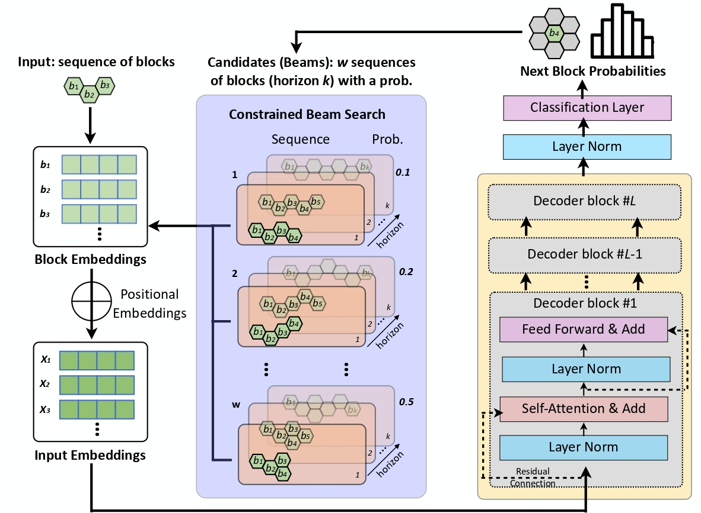

# TrajLearn: A Novel Model for Trajectory Prediction

## Overview

*TrajLearn* is a transformer-based model designed to predict future trajectories using higher-order mobility flow representations (hexagonal grids). This model integrates a beam search variant to enhance spatial continuity, providing superior accuracy compared to existing methods. It is a powerful solution for trajectory prediction tasks in autonomous vehicles, robotics, and human motion analysis.

<p align="center">
  
</p>

## Getting Started

### Prerequisites

- This implementation requires **Python version `>= 3.8`**.
- Ensure you have a compatible Python environment. Refer to `environment.yml` for the required packages.

### Step-by-Step Instructions

0. **Clone the Repository**

   First, clone the project on your computer:
     ```bash
     git clone https://github.com/amir-ni/Trajectory-prediction
     ```

1. **Download the Datasets**:

   Make the dataset downloader script executable:
     ```bash
     chmod +x ./download_data.sh
     ```
   Run the script to download the datasets. You can specify the datasets by passing them as arguments (`geolife`, `porto`, or `rome`). For example:
     ```bash
     ./download_data.sh geolife porto rome
     ```

2. **Prepare the Datasets**:

   After downloading, run the following command to prepare and transform the datasets:
     ```bash
     python3 TrajLearn/preprocess.py --input_dir <input_directory> --output_dir <output_directory> --embedding_dim <embedding_dim> --datasets <geolife|porto|rome>
     ```
   You can specify the `input_dir`, `output_dir`, and `datasets` to be processed:
     - **`--input_dir`**: Directory where the raw datasets are stored. Defaults to `./data`.
     - **`--output_dir`**: Directory where the transformed datasets will be saved. Defaults to `./data`.
     <!-- - **`--embedding_dim`**: Dimension of the generated initial axial coordination based embedding vectors. If not provided, embeddings will not be generated and training will use random initialization. -->
     - **`--datasets`**: Select which datasets to process (`geolife`, `porto`, `rome`). Multiple datasets can be processed by specifying them in a space-separated list. For example:
     ```bash
     python3 TrajLearn/preprocess.py --datasets rome geolife porto --embedding_dim 512
     ```

3. **Set Up the Model Configuration**:

   The configuration of the model, such as batch size, learning rates, and dataset-specific settings, can be passed as to model as a `yaml` configuration file. This file can also include multiple configurations and will train separate models sequentially. An example configuration used for generating results provided in the paper can be found in `configs.yaml`.

   You can create/modify this file according to your needs. Some configurations are described below and additional configurations can be found in the end of this document.
     - **`data_dir`**: Directory where the dataset is stored. If you have not changed the default output directory in the previous steps, the address would be `./data`.
     - **`dataset`**: Name of the dataset being used, such as `rome7`.
     - **`model_checkpoint_directory`**: Directory path where model checkpoints will be saved during training.
     - **`min_input_length`**: The minimum length of input sequences used during training and testing.
     - **`max_input_length`**: The maximum length of input sequences allowed for model training.
     - **`test_input_length`**: Length of the input sequence during testing.
     - **`test_prediction_length`**: The number of future steps the model will predict during testing.

   After modifying these parameters as per your requirements, save it in a `yaml` file. This file will be used during training and testing to control model behavior.

4. **Train the Model**:

   After configuring the model, you can start the training process. Use the following command:
    ```bash
    python3 main.py configs.yaml
    ```

   This will train the model using the parameters specified in the `configs.yaml` file. You can change it to your saved `yaml` file.

5. **Test the Model**:

   Once the model is trained, you can evaluate its performance by running:
    ```bash
    python3 main.py configs.yaml --test
    ```

   This will test the trained model on the test part of the dataset.


### Additional Configuration Options:

- **`test_ratio`**: Proportion of the dataset used for testing. For example, a value of `0.2` means 20% of the dataset will be used for testing.
- **`validation_ratio`**: Proportion of the dataset used for validation. For example, a value of `0.1` means 10% of the dataset will be used for validation.
- **`delimiter`**: The character that separates values in your dataset files (default is `" "`).
- **`batch_size`**: The number of samples processed together in one forward/backward pass.
- **`device`**: The computational device to use for training and testing. Set to `cuda` for GPU acceleration or `cpu` if no GPU is available.
- **`max_epochs`**: The maximum number of training epochs, where one epoch means a complete pass through the entire dataset.
- **`block_size`**: Block size used for processing sequences. Defines the length of the sequence chunks used during training and testing.
- **`learning_rate`**: Initial learning rate for the optimizer. Adjust this to control how fast the model learns.
- **`weight_decay`**: Regularization term to avoid overfitting by penalizing large weights. Higher values provide stronger regularization.
- **`beta1`**: Beta1 hyperparameter for the Adam optimizer, which controls the decay rate for the first moment estimate.
- **`beta2`**: Beta2 hyperparameter for the Adam optimizer, controlling the decay rate for the second moment estimate.
- **`grad_clip`**: Threshold for gradient clipping. Gradients that exceed this value will be clipped to prevent exploding gradients.
- **`decay_lr`**: Boolean flag to indicate whether the learning rate should be decayed over time.
- **`warmup_iters`**: Number of iterations during which the learning rate will increase from a small value to the initial learning rate (used in learning rate scheduling).
- **`lr_decay_iters`**: Number of iterations over which the learning rate decays.
- **`min_lr`**: Minimum learning rate after decay. The learning rate will not decrease below this value.
- **`seed`**: Random seed for reproducibility. Ensures that experiments can be replicated with the same results.
- **`n_layer`**: Number of layers in the transformer model. More layers can increase model capacity but also computational cost.
- **`n_head`**: Number of attention heads in the transformer model, which allows the model to focus on different parts of the input sequence simultaneously.
- **`n_embd`**: Dimensionality of the embedding space. This represents the size of the vector representations for each token in the input sequence.
- **`bias`**: Boolean flag to indicate whether to include bias terms in the model's layers. Set to `False` to exclude bias.
- **`dropout`**: Dropout rate used for regularization. A value of `0` means no dropout will be applied.
- **`custom_initialization`**: A boolean flag that specifies whether to use a axial coordination based initialization for the model's training.
- **`train_from_checkpoint_if_exist`**: A boolean flag that indicates whether to resume training from an existing checkpoint if one is found.
- **`patience`**: Integer value indicating the number of epochs to wait for before early stopping.
- **`continuity`**: Boolean flag to enforce spatial continuity constraints on predictions.
- **`beam_width`**: Integer specifying the beam width for beam search.
- **`store_predictions`**: Boolean flag to enable or disable storing the predicted sequences.


## Contact

This project was developed by [Amirhossein Nadiri](https://github.com/amir-ni).

For any inquiries or collaboration, feel free to reach out at [anadiri@yorku.ca](mailto:anadiri@yorku.ca).

## License

This project is open-source software licensed under the [LICENSE](LICENSE).

## Citation

If you use this project or TrajLearn in your research, please consider citing it as follows:

```tex
@inproceedings{
}
```