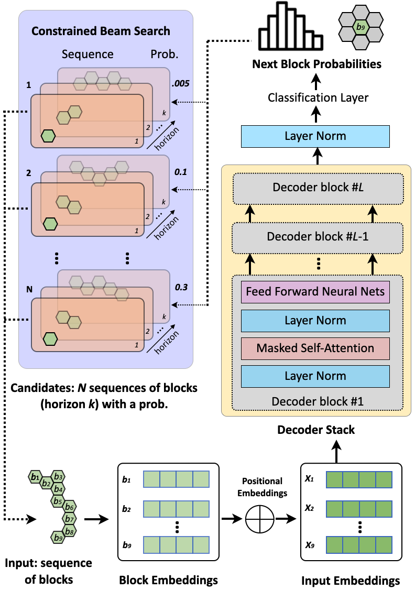

# TrajLearn: A Novel Model for Trajectory Prediction



## Abstract

Trajectory prediction is a crucial task with broad applications in autonomous vehicles, robotics, human motion analysis, and more. It involves estimating the future path of an entity based on its current state and historical data. Despite the advent of deep learning techniques for trajectory prediction, these models often struggle with complex spatial dependencies due to the dynamic nature of environments. Our work introduces _TrajLearn_, a groundbreaking model that predicts future trajectories using generative models of higher-order mobility flow representations (hexagons). Incorporating a beam search variant, TrajLearn not only respects spatial constraints for path continuity but also significantly outperforms existing methods, marking a substantial advancement in trajectory prediction.

## Project Structure

This project includes several key files necessary for training and evaluating the TrajLearn model:

- `TrajectoryBatchDataset.py`: Handles dataset loading and preprocessing.
- `config.yaml`: Contains configuration parameters for model training and evaluation.
- `environment.yml`: Specifies the Python environment and dependencies.
- `main.py`: The main script to train or test the model.
- `model.py`: Defines the TrajLearn model architecture.
- `test.py`: Contains tests for model evaluation.
- `trainer.py`: Manages the training process.

## Configuration (`config.yaml`)

The `config.yaml` file specifies various parameters for the model, such as training and testing ratios, batch size, device settings, learning rates, and more. A snippet of the configuration for a specific dataset (`rome7`) includes:

```yaml
rome7-12-8-512:
  test_ratio: 0.2
  validation_ratio: 0.1
  delimiter: " "
  min_input_length: 5
  max_input_length: 20
  test_input_length: 10
  test_prediction_length: 5
  batch_size: 128
  device: cuda
  max_epochs: 4
  ...
  model_checkpoint_directory: /local/data1/users/anadiri/models/
```

## Getting Started

### Prerequisites

- This implementation requires **Python version >= 3.8**.
- Ensure you have a compatible Python environment. Refer to `environment.yml` for the required packages.

### Training the Model

To train the TrajLearn model, run the following command:
python3 main.py config.yaml

### Testing the Model

For testing, execute:
python3 main.py config.yaml --test
